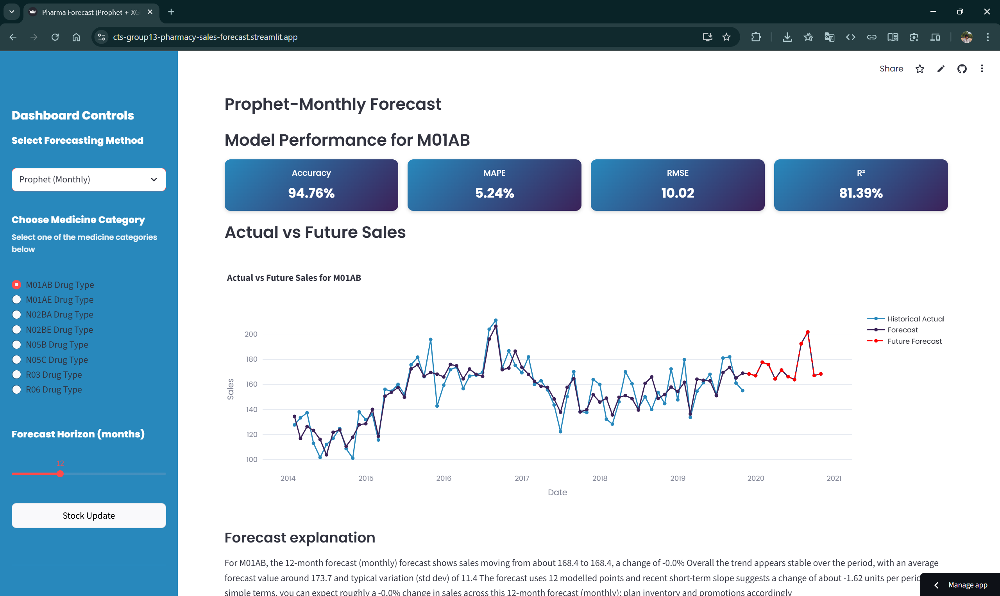
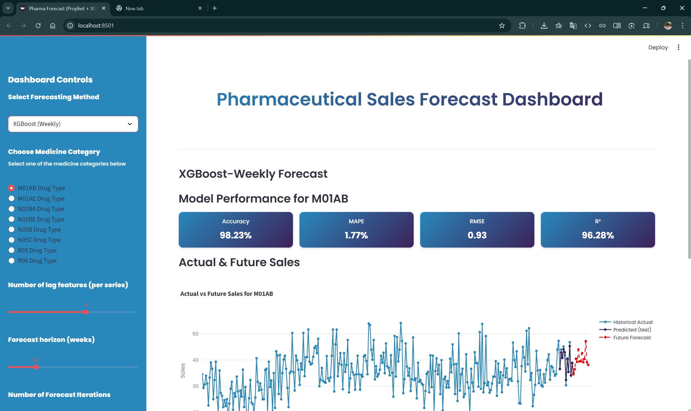
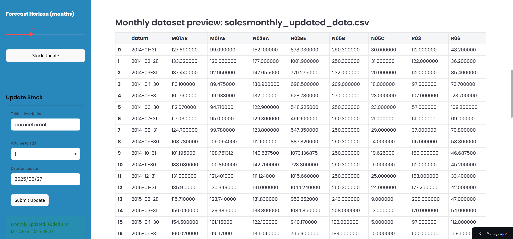

# Pharmaceutical Sales Forecast Dashboard  

## Description  
The **Pharmaceutical Sales Forecast Dashboard** is a Streamlit-based web application designed for forecasting pharmaceutical sales across multiple product categories. It integrates two forecasting techniques—**Prophet** (monthly) and **XGBoost** (weekly)—to provide accurate, interactive, and user-friendly sales insights. The dashboard supports detailed visualizations, performance metrics, and AI-generated explanations of forecast trends.  

## Features  
- **Dual Forecasting Methods**: Prophet (monthly) and XGBoost (weekly) forecasting models  
- **Multiple Product Categories**: Supports 8 pharmaceutical categories (M01AB, M01AE, N02BA, N02BE, N05B, N05C, R03, R06)  
- **Interactive Visualizations**: Charts displaying historical data and forecast projections  
- **Performance Metrics**: Includes Accuracy, MAPE, RMSE, and R²  
- **AI-Generated Explanations**: Automatic interpretation of forecast trends using Google’s Generative AI  
- **Customizable Forecast Horizon**: Users can adjust the forecast period as needed  
- **Data Export**: Download forecast results for further offline analysis  

## Screenshots  

### Prophet Monthly Forecast  
  

### XGBoost Weekly Forecast  
  

### Dataset Updation  
  

## Installation

1. Clone the repository or download the source code
   ```bash
   git clone https://github.com/vamsikeshwaran/CTS_NPN
   ```
   
2. Create a virtual environment (recommended):
   ```bash
   python -m venv .venv
   .venv\Scripts\activate
   ```

3. Install the required dependencies:
   ```bash
   pip install -r requirements.txt
   ```

   Alternatively, you can install dependencies individually:
   ```bash
   pip install streamlit>=1.20.0 pandas>=1.3.0 numpy>=1.20.0 plotly>=5.5.0 prophet>=1.1.0 matplotlib>=3.5.0 scikit-learn>=1.0.0 google-generativeai>=0.3.0 xgboost>=1.5.0
   ```

## Usage

1. Redirect to website folder
   ```bash
   cd website
   ```
   
2. Run the Streamlit application:
   ```bash
   streamlit run app.py
   ```

3. Open your web browser and navigate to the provided local URL (typically http://localhost:8501)

5. Use the sidebar controls to:
   - Select the forecasting method (Prophet or XGBoost)
   - Choose a medicine category
   - Set date ranges and forecast horizons
   - View and download forecast results

## Project Structure

- `app.py`: Main Streamlit application file
- `Prophet_models/`: Directory to store trained Prophet models
- `monthly_dataset.csv`: Input dataset for Prophet forecasts
- `weekly_dataset.csv`: Input dataset for XGBoost forecasts
- `requirements.txt`: Python dependencies
- `README.md`: Project documentation
